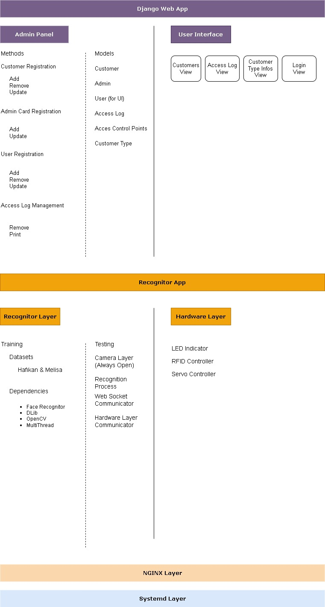

# Face Recognition Access Control System

Bu proje, bir spor salonu için geliştirilen yüz tanıma tabanlı giriş-çıkış kontrol sistemidir.  
Web üzerinden izlenebilir ve yönetilebilir bir Django arayüzü sağlar.

## 🔧 Kullanılan Teknolojiler
- Python 3.10+
- Django
- OpenCV
- Face Recognition
- PostgreSQL (ya da SQLite dev aşamasında)
- Git

## 🚀 Geliştiriciler
- Hafıkan Yeşilyurt
- Melisa Erocağı